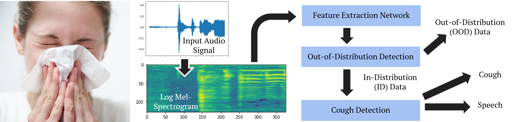
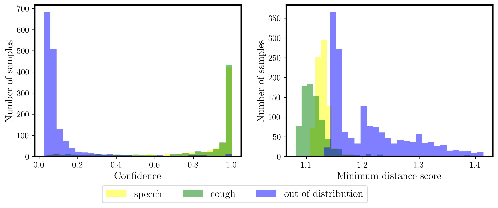
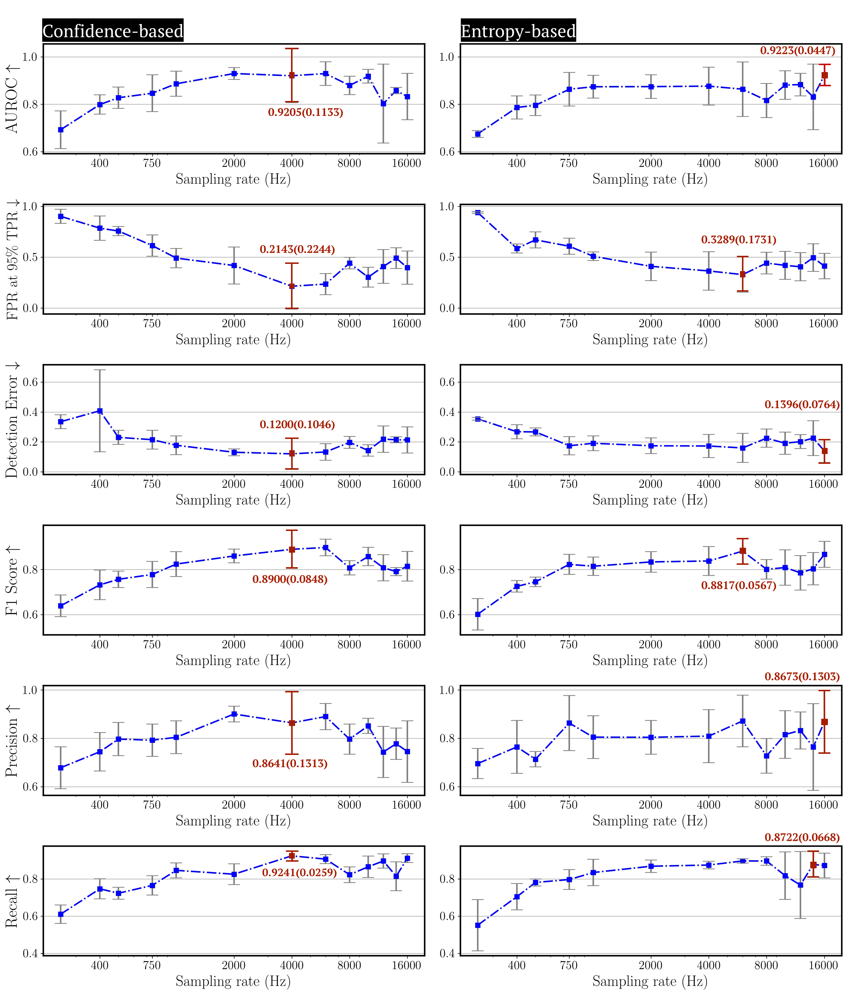
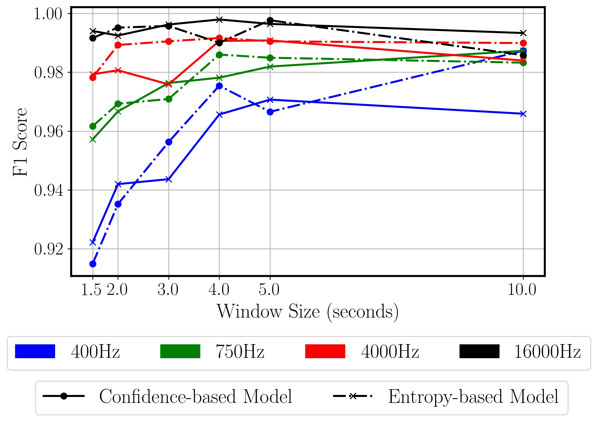
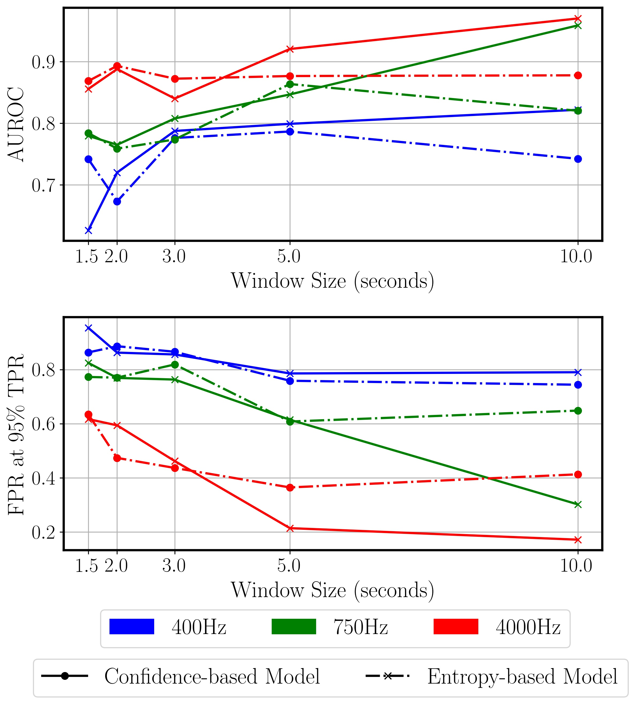
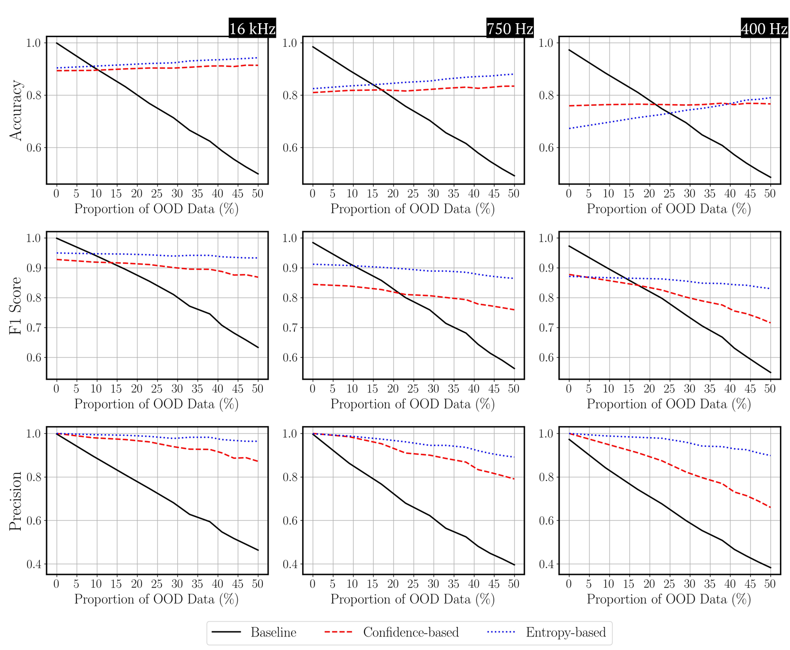

# OOD-CoughDet

Code for "Robust Cough Detection with Out-of-Distribution Detection" https://www.techrxiv.org/articles/preprint/Robust_Cough_Detection_with_Out-of-Distribution_Detection/21700379

 
Work flow of the robust cough detection with out-of-distribution detection. We first converted audio signals into log
mel-spectrograms followed by a feature extraction network. Then, we used OOD detection to recognize ID and OOD data. The
ID data is classified into cough and speech. Note that we used the same network to do OOD detection and cough detection, so
no additional computation is involved. This pipeline produces robust cough detection by recognizing and removing unknown
classes.

## Dataset :books:

[[Dataset A](https://drive.google.com/drive/u/1/folders/17ITho6nIlWE9gHzbZRIGQUZf-tYWf7_M)]

[[Dataset B](https://drive.google.com/drive/u/1/folders/17ITho6nIlWE9gHzbZRIGQUZf-tYWf7_M)]

### Composition of two datasets (The number of segments or the recording time are shown in brackets)
|        |         | Dataset A          | Dataset B   |
|:------:|:-------:|:--------------:|:--------------:|
|ID      | Cough   | [ESC-50](https://github.com/karolpiczak/ESC-50)(40)|  [Coughvid](https://www.nature.com/articles/s41597-021-00937-4)(~37,000)  |
|        |         | [FSDKaggle2018](https://zenodo.org/record/2552860#.Y-uyxnbMJD8)(273) | [FluSense](https://github.com/Forsad/FluSense-data)(2486) |
|        | Speech  | [LibriSpeech](http://www.openslr.org/12)(~ 1 hr) | [Musan (speech)](https://www.openslr.org/17/) (~ 60 hrs)    |
|        |         |                |   [LibriSpeech](http://www.openslr.org/12)(~ 1 hr)   |
| OOD    |         |         |    [Musan (speech)](https://www.openslr.org/17/) (~ 49 hrs)    |

### The number of samples we used for each setting

## Models :robot:
We implemented two models in our work.
- [Learning Confidence Estimates for Neural Networks](https://github.com/uoguelph-mlrg/confidence_estimation)
- [Entropic Out-of-Distribution Detection](https://github.com/dlmacedo/entropic-out-of-distribution-detection)

### OOD Density Plots
Density Plots for Confidence-based OOD Detection and Entropy-based OOD Detection generated from the best performance settings with sampling frequency f = 4 kHz and
f = 16 kHz separately and window size τ = 5 s (Sections. IV-C and IV-D). The left plot is confidence density and the right is the minimum distance score density.

 

## Usage :gear:
Run `train_val.sh` to train models.

Run `test_detect.sh` to validate models.

Run `Accuracy_varyingOOD.sh` to test with variant OOD proportion.

## Contributions :handshake:
  - Ddynamically evaluate OOD detection performance at various frequencies of interest while balancing ID and OOD samples.
  - Integrating OOD methodologies into the cough detection task to solve low data quality issues. 
  - Evaluating the dependency of the OOD cough detection model to several parameters such as sampling rates and window size for feature extraction. 
  - Demonstrating that models with OOD sample detection techniques improve overall cough classification accuracy as the percent of OOD samples increase. The gains become more prominent at higher sample rates and for higher proportions of OOD samples in the input audio signals.
  
## Main Results :memo:

### OOD Detection Performance for Different Sampling Rates
 

### OOD Detection Performance for Dfferent Window Sizes

| ID Task          | OOD Task   |
|:------:|:---:|
| | |

### Detection for Different OOD Proportions
 

## Citation :link:
